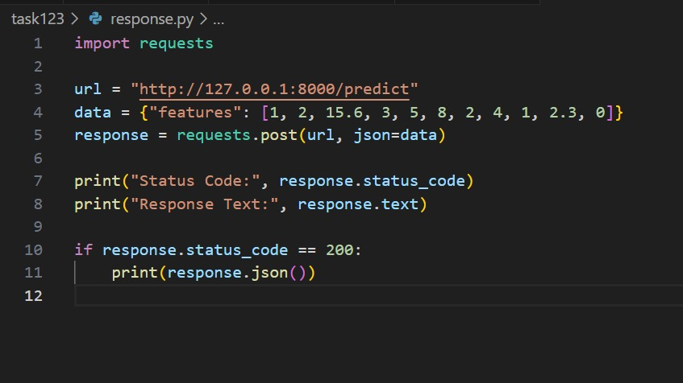
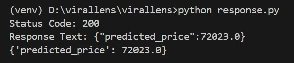

# 💻 Laptop Price Prediction

A complete machine learning pipeline for predicting laptop prices using RandomForest Regressor, featuring data preprocessing, model training, evaluation, and FastAPI deployment.

## 🌟 Features

- **Complete ML Pipeline**: From data preprocessing to model deployment
- **Data Analysis & Visualization**: Comprehensive exploratory data analysis
- **Model Training & Evaluation**: RandomForest Regressor with performance metrics
- **REST API**: FastAPI server for real-time predictions
- **Easy Deployment**: Ready-to-use API endpoints

## 📂 Project Structure

```
task123/
├── 📊 Data & Models
│   ├── laptopData.csv           # Dataset
│   ├── rf_model.pkl             # Trained RandomForest model
│   └── scaler.pkl               # Fitted StandardScaler
├── 📓 Notebooks & Scripts
│   ├── task1and2.ipynb          # Data handling & model training
│   ├── train_save_model.py      # Model training script
│   └── app.py                   # FastAPI server
├── 🧪 Testing
│   ├── response.py              # API testing script
│   └── nof.py                   # Feature count utility
├── 📷 Documentation
│   ├── request.jpeg             # API request example
│   └── response.jpeg            # API response example
└── 📋 requirements.txt          # Dependencies
```

## 🚀 Quick Start

### Prerequisites

- Python 3.7+
- pip package manager

### Installation

1. **Clone the repository**
   ```bash
   git clone https://github.com/aliya-singh/virallens.git
   cd task123
   ```

2. **Install dependencies**
   ```bash
   pip install -r requirements.txt
   ```

3. **Run the Jupyter notebook** (Optional - for data exploration)
   ```bash
   jupyter notebook task1and2.ipynb
   ```

4. **Train and save the model** (if model files don't exist)
   ```bash
   python train_save_model.py
   ```

5. **Start the FastAPI server**
   ```bash
   uvicorn app:app --reload
   ```

The API will be available at `http://localhost:8000`

## 📡 API Usage

### Endpoint
```
POST /predict
```

### Test the API

**Using the provided test script:**
```bash
python response.py
```

**Expected Response:**
```json
{
    "predicted_price": 72023.0
}
```

**Using curl:**
```bash
curl -X POST "http://localhost:8000/predict" \
     -H "Content-Type: application/json" \
     -d '{"features": [your_feature_array]}'
```

## 🛠️ Tech Stack

| Component | Technology |
|-----------|------------|
| **Language** | Python 3.7+ |
| **Data Processing** | Pandas, NumPy |
| **Machine Learning** | Scikit-learn |
| **Model** | RandomForest Regressor |
| **API Framework** | FastAPI |
| **Server** | Uvicorn |
| **Development** | Jupyter Notebook |

## 📈 Model Performance

The RandomForest Regressor model has been trained and evaluated on laptop pricing data with the following characteristics:

- **Algorithm**: RandomForest Regressor
- **Preprocessing**: StandardScaler for feature normalization
- **Evaluation**: Comprehensive metrics available in `task1and2.ipynb`

## 📸 Screenshots

| API Request | API Response |
|-------------|--------------|
|  |  |

## 🗂️ File Descriptions

| File | Description |
|------|-------------|
| `task1and2.ipynb` | Complete data analysis, preprocessing, and model training notebook |
| `train_save_model.py` | Standalone script to train and save the model |
| `app.py` | FastAPI application with prediction endpoint |
| `response.py` | Test script for API endpoint |
| `nof.py` | Utility to count dataset features |
| `laptopData.csv` | Training dataset |
| `rf_model.pkl` | Serialized trained model |
| `scaler.pkl` | Serialized feature scaler |

## 🤝 Contributing

1. Fork the repository
2. Create your feature branch (`git checkout -b feature/AmazingFeature`)
3. Commit your changes (`git commit -m 'Add some AmazingFeature'`)
4. Push to the branch (`git push origin feature/AmazingFeature`)
5. Open a Pull Request

## 📝 License

This project is licensed under the MIT License - see the [LICENSE](LICENSE) file for details.

## 📧 Contact

For questions or suggestions, please open an issue in the repository.

---

⭐ **Star this repository if you found it helpful!**